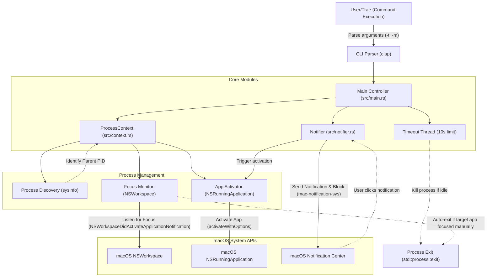

# Terminal Notificator

🚀 一个极致轻量、启动速度极快的 macOS 命令行通知工具。

## 愿景
`terminal-notificator` 的核心使命是提供“无缝回归”的体验：当长耗时任务完成并弹出通知时，用户只需点击通知，即可瞬间唤起并跳转回最初执行命令的终端窗口（如 Cursor, Warp, iTerm2 等），无需任何额外配置。

## 核心特性
1.  **零配置上下文感知**: 自动检测运行 CLI 的父进程（终端模拟器）。点击通知时，精准激活发起请求的窗口，无需手动指定 ID。
2.  **高性能**: 使用 Rust 编写，确保毫秒级的启动速度和极低的资源占用。
3.  **原生集成**: 直接调用 macOS 原生 API，不依赖 `osascript` 或其他外部进程。
4.  **单二进制文件**: 静态链接，无运行时依赖。

## 安装

### 使用 Homebrew (推荐)
```bash
brew tap youruser/tap
brew install terminal-notificator
```

### 从源码构建
要求安装有 [Rust 环境](https://rustup.rs/)。

```bash
git clone https://github.com/youruser/terminal-notificator.git
cd terminal-notificator
cargo build --release
```

生成的二进制文件位于 `target/release/terminal-notificator`。

## 使用方法

### 基本用法
```bash
terminal-notificator -t "构建完成" -m "您的编译任务已顺利结束。"
```

### 参数说明
- `-t, --title <TITLE>`: 设置通知标题（默认为 "Terminal Notificator"）。
- `-m, --message <MESSAGE>`: 设置通知正文内容。
- `-v, --verbose`: 启用详细模式，查看进程探测和 Bundle ID 检索的调试信息。
- `-h, --help`: 查看帮助信息。

## 验证功能
项目中包含一个 `verify.sh` 脚本，可以快速实测“点击跳转”功能：

```bash
./verify.sh
```

## 技术栈
- **Rust**: 核心语言。
- **Clap**: 命令行解析。
- **mac-notification-sys**: 基于原生 API 的通知发送。
- **sysinfo & AppKit**: 进程探测与窗口激活。

## 架构图


## 许可证
MIT
