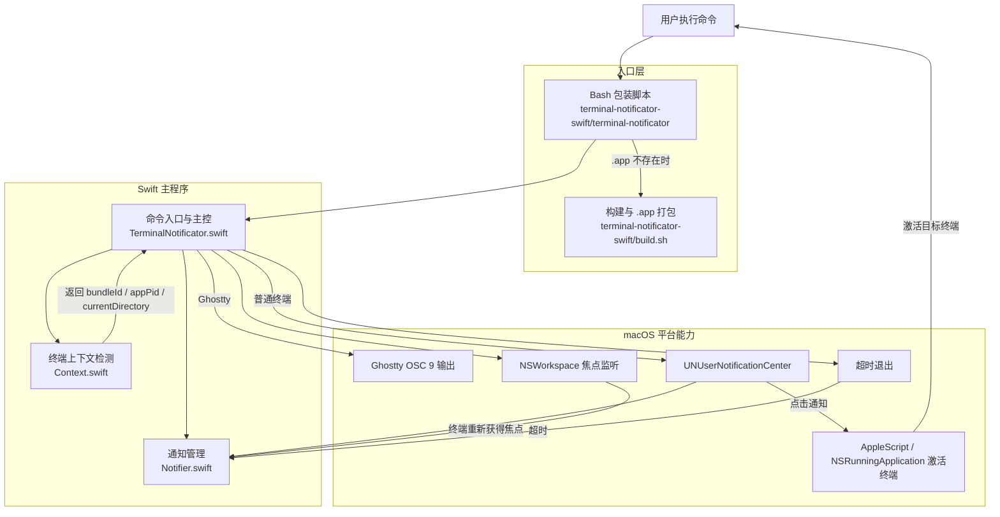

```mermaid
flowchart TD
    U["用户执行命令"]
    subgraph ENTRY["入口层"]
        SH["Bash 包装脚本
terminal-notificator-swift/terminal-notificator"]
        BUILD["构建与 .app 打包
terminal-notificator-swift/build.sh"]
    end
    subgraph APP["Swift 主程序"]
        MAIN["命令入口与主控
TerminalNotificator.swift"]
        CTX["终端上下文检测
Context.swift"]
        NOTI["通知管理
Notifier.swift"]
    end
    subgraph PLATFORM["macOS 平台能力"]
        OSC9["Ghostty OSC 9 输出"]
        UN["UNUserNotificationCenter"]
        FOCUS["NSWorkspace 焦点监听"]
        ACT["AppleScript / NSRunningApplication 激活终端"]
        TIMER["超时退出"]
    end
    U --> SH
    SH -->|".app 不存在时"| BUILD
    SH --> MAIN
    MAIN --> CTX
    MAIN --> NOTI
    CTX -->|返回 bundleId / appPid / currentDirectory| MAIN
    MAIN -->|Ghostty| OSC9
    MAIN -->|普通终端| UN
    UN --> NOTI
    MAIN --> FOCUS
    MAIN --> TIMER
    UN -->|点击通知| ACT
    FOCUS -->|终端重新获得焦点| NOTI
    TIMER -->|超时| NOTI
    ACT -->|激活目标终端| U
```
