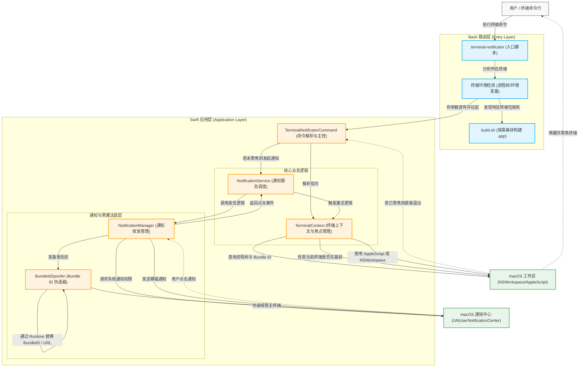

```mermaid
graph TD
    %% 样式定义
    classDef default fill:#f9f9f9,stroke:#333,stroke-width:1px
    classDef bash fill:#e1f5fe,stroke:#03a9f4,stroke-width:2px
    classDef swift fill:#fff3e0,stroke:#ff9800,stroke-width:2px
    classDef os fill:#e8f5e9,stroke:#4caf50,stroke-width:2px

    User["用户 / 终端命令行"]
    OS_Notif["macOS 通知中心 (UNUserNotificationCenter)"]:::os
    OS_Workspace["macOS 工作区 (NSWorkspace/AppleScript)"]:::os

    subgraph BashLayer ["Bash 路由层 (Entry Layer)"]
        Router["terminal-notificator (入口脚本)"]:::bash
        DetectApp["终端环境检测 (进程树/环境变量)"]:::bash
        Builder["build.sh (按需编译构建 .app)"]:::bash
    end

    subgraph SwiftLayer ["Swift 应用层 (Application Layer)"]
        CLI["TerminalNotificatorCommand (命令解析与主控)"]:::swift

        subgraph Core ["核心业务逻辑"]
            Context["TerminalContext (终端上下文与焦点管理)"]:::swift
            Service["NotificationService (通知服务调度)"]:::swift
        end

        subgraph Notification ["通知与黑魔法底层"]
            Manager["NotificationManager (通知收发管理)"]:::swift
            Spoofer["BundleIdSpoofer (Bundle ID 伪造器)"]:::swift
        end
    end

    %% 流程关系
    User -->|"执行终端命令"| Router
    Router -->|"分析所在终端"| DetectApp
    DetectApp -->|"发现特定终端包缺失"| Builder
    DetectApp -->|"将参数透传并拉起"| CLI

    CLI -->|"解析指令"| Context
    Context -->|"查询进程树与 Bundle ID"| OS_Workspace
    Context -->|"检查当前终端是否在最前"| OS_Workspace
    OS_Workspace -.->|"若已聚焦则直接退出"| CLI

    CLI -->|"若未聚焦则发起通知"| Service
    Service -->|"调用发信逻辑"| Manager
    Manager -->|"请求系统通知权限"| OS_Notif
    Manager -->|"准备发信前"| Spoofer

    Spoofer -->|"通过 Runtime 替换 BundleID / URL"| Spoofer
    Spoofer -->|"伪装成宿主终端"| OS_Notif

    Manager -->|"发送横幅通知"| OS_Notif
    OS_Notif -.->|"用户点击通知"| Manager

    Manager -->|"返回点击事件"| Service
    Service -->|"触发激活逻辑"| Context
    Context -->|"使用 AppleScript 或 NSWorkspace"| OS_Workspace
    OS_Workspace -.->|"唤醒并聚焦终端"| User
```
